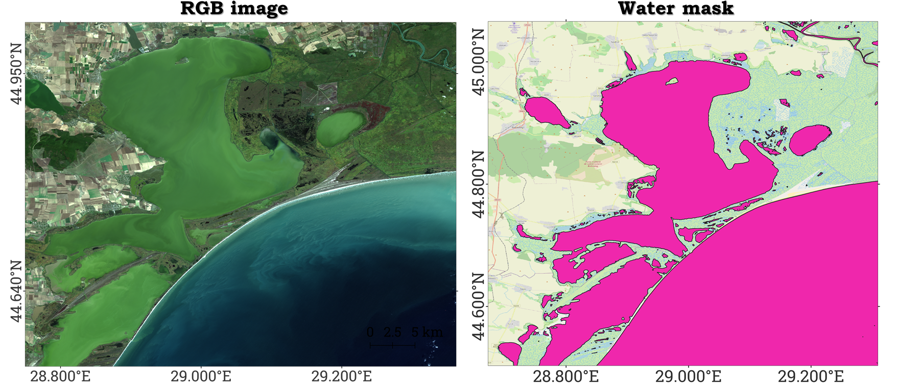

# Water Mask extraction tool 


The Water Mask Extraction Tool is a Python package designed to extract water masks from satellite imagery. The tool offers two distinct methods for water mask extraction:

- **Image-based Method**: This method processes the input satellite image directly to identify water bodies using image processing techniques, such as SWIR threshold and MNDWI index.

- **JRC-based Method**: This method utilizes the JRC (Joint Research Centre) Global Surface Water dataset to extract water masks. The JRC dataset provides a comprehensive and globally consistent water surface map.

The tool is designed to be user-friendly, allowing users to choose between the two methods based on their specific needs and available data. The output is a shapefile that can be used in various GIS applications for further analysis.

### Dependencies management and package instalation
To ensure smooth operation, the package relies on several Python libraries. To set up the environment and install the package, you can recreate the conda environment with all the necessary dependencies. This command should be run from the root of the repository:
```
conda env create -f environment.yml
```
If you prefer to use an existing conda environment, you can activate it and then install the pacereader package in development mode. This allows you to make changes to the code and test them without needing to reinstall the package. Run the following command from the root of the repository:
```
pip install -e .
```
Alternatively, you can install the package directly from GitHub using the command:
```
pip install git+https://github.com/thaimunhoz/water_mask
```

### Inputs and Outputs
*Inputs*
- **mask_method (str)**: The method to be used for water mask extraction. It can be either "image_based" or "jrc_based".
- **img_path (str)**: The path to the input satellite image.

*Outputs*
- **Shapefile**: The output is a shapefile containing the extracted water mask. The shapefile will be saved at the specified output_path.



### Usage example
To see examples of how to use the package, refer to the Jupyter notebook provided in the notebooks folder. The notebook contains detailed examples and usage scenarios.
